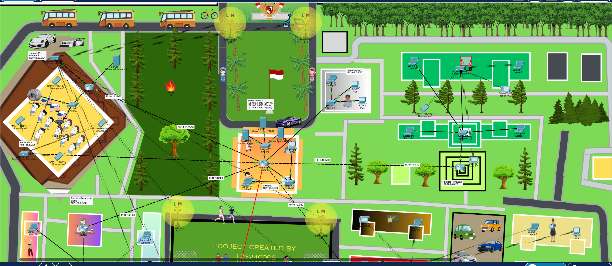
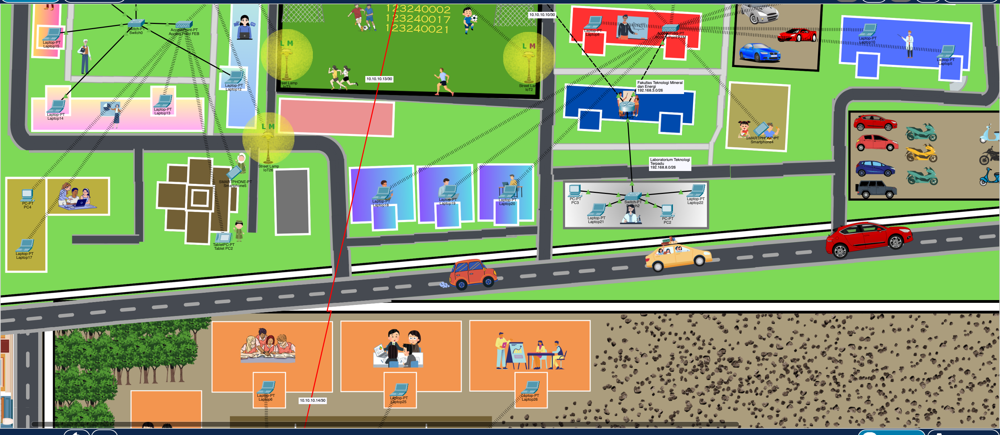
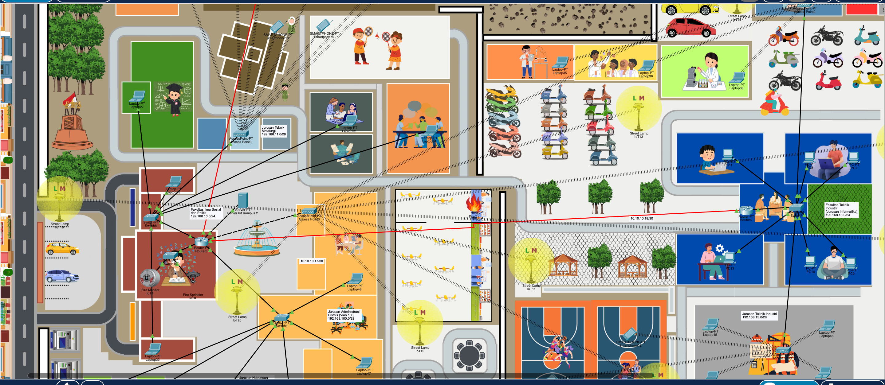

# 🌐 Topologi Jaringan Interkoneksi Kampus Universitas & IoT

Proyek ini berisi rancangan dan konfigurasi simulasi topologi jaringan komputer terdistribusi untuk lingkungan kampus menggunakan **Cisco Packet Tracer**. Jaringan ini menghubungkan berbagai fakultas, laboratorium, gedung rektorat, pusat data kampus (Data Center), fasilitas olahraga, serta infrastruktur penerangan jalan pintar berbasis Internet of Things (IoT).

---

## 📸 Topologi Jaringan Kampus





---

## 📌 Skema Subnetting & Pengalamatan IP Kampus

Berikut adalah rincian pembagian alamat IP (IP Addressing) pada masing-masing segmen LAN Fakultas/Gedung dan WAN Interkoneksi Router:

### 🏫 1. Jaringan Lokal Fakultas & Area Kampus (LAN)

| Gedung / Fakultas / Segmen | Network Subnet | Tipe Koneksi | Deskripsi Perangkat |
| :--- | :--- | :--- | :--- |
| **Fakultas Ekonomi & Bisnis** | `192.168.10.0/24` | LAN / Wireless (AP) | PC, Laptop, Access Point, Smartphone |
| **Fakultas Teknologi Informasi (FTI)** | `192.168.20.0/24` | LAN / Switch Utama | PC Lab, Laptop Dosen/Mahasiswa |
| **Laboratorium Komputer FTI** | `192.168.30.0/24` | LAN (Cable / Switch) | PC Workstation Lab Komputer |
| **Gedung Rektorat / Administrasi** | `192.168.40.0/24` | LAN / Wireless (AP) | PC Staf, Laptop Rektorat, Smart Device |
| **Fakultas Ilmu Sosial & Politik** | `192.168.50.0/24` | LAN / Access Point | PC Ruang Dosen, Laptop, Mobile Devices |
| **Infrastruktur Lampu Jalan (IoT)** | `192.168.60.0/24` | IoT / Wireless MCU | Street Lamp IoT (LM1 - LM6) & MCU Controller |

---

### 🖥️ 2. Pusat Data & Server Kampus (Data Center)

| Server Kampus | Subnet Network | Fungsi & Deskripsi |
| :--- | :--- | :--- |
| **Server Utama Kampus (SIAKAD/Web)** | `192.168.100.0/24` | Server Sistem Informasi Akademik & Portal Utama |
| **Server IoT & Monitoring** | `192.168.200.0/24` | Server Kontrol Lampu Jalan Pintar & Sensor Kampus |

---

### 🌐 3. Jalur Interkoneksi Router Kampus (WAN & Routing)

| Antar Router | Segment IP / Point-to-Point | Metode Routing |
| :--- | :--- | :--- |
| **Router Rektorat ↔ Router FTI** | `10.10.10.0/30` (`10.10.10.1` - `10.10.10.2`) | **Routing Dinamis** *(OSPF / RIPv2)* |
| **Router FTI ↔ Router Ekonomi** | `10.10.20.0/30` (`10.10.20.1` - `10.10.20.2`) | **Routing Dinamis** *(OSPF)* |
| **Router Ekonomi ↔ Router Server Data Center** | `10.10.30.0/30` (`10.10.30.1` - `10.10.30.2`) | **Routing Statis** |

---

## ⚙️ Fitur Utama Jaringan Kampus

* **Smart Campus IoT Integration:** Pengendalian penerangan jalan otomatis (*Street Lamp IoT*) yang tersebar di area taman, lapangan, dan jalan utama kampus.
* **Hybrid Inter-Router Routing:** Kombinasi Protokol Routing Dinamis (OSPF) untuk fleksibilitas antar fakultas dan Routing Statis menuju Server Pusat Data.
* **High-Density Wireless Access:** Penyediaan Wireless Access Point di area publik, lapangan, dan ruang kelas untuk mendukung mobilitas mahasiswa.
* **Centralized Campus Server:** Terhubung langsung ke Data Center Kampus untuk layanan portal akademik (SIAKAD), e-learning, dan server IoT.

---

## 🚀 Cara Menjalankan Simulasi

1. Unduh dan pasang aplikasi **Cisco Packet Tracer** (versi 8.0 atau lebih baru disarankan).
2. Klon repositori ini atau unduh berkas simulasi `.pkt`:
   ```bash
   git clone [https://github.com/username/repository-topologi-kampus.git](https://github.com/username/repository-topologi-kampus.git)
